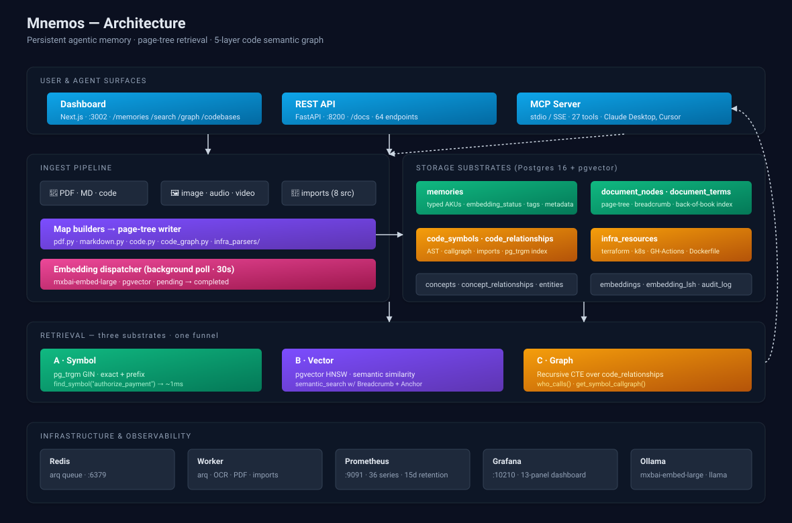

# Mnemos — Architecture



> One-page system overview. For the why-it's-built-this-way story, see
> [`PRODUCT_WRITEUP.md`](PRODUCT_WRITEUP.md). For deep-dives on individual
> substrates, see [`CODE_INGESTION_5_LAYERS.md`](CODE_INGESTION_5_LAYERS.md)
> and [`MEMORY_TAXONOMY.md`](MEMORY_TAXONOMY.md).

## 1. Surfaces

Three coequal entry points, all backed by the same storage:

| Surface | Stack | Audience |
|---|---|---|
| **Dashboard** | Next.js 14 + Tailwind, server-rendered with API fetchers | Humans |
| **REST API** | FastAPI + gunicorn (uvicorn workers) | Scripts, SDKs, the dashboard itself |
| **MCP server** | stdio + SSE, 27 typed tools | Claude Desktop, Cursor, any MCP-aware agent |

The API publishes an OpenAPI 3 spec at `/openapi.json` and an interactive
Swagger UI at `/docs`. The MCP server is a separate process (or in-process
in the same container) that speaks the Model Context Protocol.

## 2. Ingest pipeline

```
file → map builder → writer → typed substrates → embedding poll → searchable
```

The map builder is dispatched by source type:

| Source | Builder | Output |
|---|---|---|
| PDF | `ingest/map_builders/pdf.py` (PyMuPDF) | doc-root + per-page nodes + chunks + back-of-book terms |
| Markdown | `ingest/map_builders/markdown.py` | nested doc → section → paragraph tree with line ranges |
| Code | `ingest/map_builders/code.py` + `code_graph.py` | file + per-symbol nodes (function/class/method) + call/import edges |
| Terraform | `ingest/infra_parsers/terraform.py` | resource/module/data nodes + cross-reference `depends_on` |
| Kubernetes YAML | `ingest/infra_parsers/kubernetes.py` | each object (Deployment, Service, ConfigMap, …) + ref-derived deps |
| GitHub Actions | `ingest/infra_parsers/github_actions.py` | workflow + job nodes with `needs:` graph |
| Dockerfile | `ingest/infra_parsers/dockerfile.py` | image + stage nodes with depends_on edge |
| Image / audio / chat / email / log / html | (Sprint D follow-up) | per-source builders |

The **writer** (`ingest/map_builders/writer.py` for content,
`ingest/map_builders/code_writer.py` for code-graph) persists all nodes
in topological order and updates the `memories ↔ document_nodes` link
in one transaction.

Embeddings are queued by leaving `memories.embedding_queued_at = NULL`;
the **embedding dispatcher** runs a 30-second background poll, picks up
pending rows, calls Ollama (`mxbai-embed-large`), stores vectors in
`pgvector`, and flips status to `completed`. The dispatcher exposes
Prometheus gauges for queue depth and oldest-pending-age.

## 3. Storage substrates

All in one Postgres 16 instance with the `pgvector` and `pg_trgm`
extensions. The schema partitions cleanly by concern:

| Table family | Purpose |
|---|---|
| `memories`, `tags[]`, `metadata jsonb` | Typed Atomic Knowledge Units (AKUs). Source-of-truth content. |
| `document_nodes`, `document_terms` | Structural index — the page tree. Anchors carry source-specific position (page_num, line range, ast_path). |
| `embeddings`, `memory_embeddings`, `embedding_lsh` | Vector substrate. HNSW over `pgvector`; LSH for cheap duplicate prefilter. |
| `code_symbols`, `code_relationships`, `code_semantic_summaries` | Code-graph substrate. Symbols with `qualified_name`, edges typed (calls/imports/extends/decorated-by/...). |
| `infra_resources` | Operational substrate. Terraform/k8s/GH-Actions/Dockerfile, with `depends_on` and parsed properties. |
| `codebases`, `code_files` | Codebase metadata + per-file imports + definitions. |
| `concepts`, `concept_relationships`, `entities` | Knowledge-graph substrate. |
| `decision_logs`, `audit_log` (partitioned monthly) | Traceability + compliance. |

Schema is managed via numbered migrations in `db/migrations/` with
forward + rollback pairs. Current version: `0.21.0`.

## 4. Retrieval — three substrates, one funnel

```
                                 ┌─────────────────────┐
  query / agent prompt  ────────▶│ Retrieval Planner    │  (in flight — Sprint E)
                                 └─────────┬───────────┘
                                           ▼
              ┌────────────────────────────┴────────────────────────────┐
              │                            │                              │
              ▼                            ▼                              ▼
       ┌─────────────┐             ┌─────────────┐                 ┌─────────────┐
       │ A · Symbol  │             │ B · Vector  │                 │ C · Graph    │
       │ trie (trgm) │             │ pgvector    │                 │ recursive CTE│
       └──────┬──────┘             └──────┬──────┘                 └──────┬──────┘
              │                            │                                │
              └─────────── Fusion (RRF + weighted) ──────────────────────────
                                           ▼
                                  Up-project + cite
                                           ▼
                              { result, breadcrumb, anchor }
```

**Substrate A — symbol lookup.** `pg_trgm` GIN indexes on
`code_symbols.name` and `qualified_name` give sub-millisecond exact and
prefix lookups. The MCP `find_symbol(prefix=...)` tool exercises this
directly.

**Substrate B — vector similarity.** `pgvector` HNSW over chunk
embeddings. The hybrid-search service combines vector + keyword
(`ts_rank_cd`) + recency weights. Results are enriched with the page-tree
breadcrumb (`<doc> > §<section> > p.<N>`) and the source-specific
anchor JSON via a recursive CTE walking `document_nodes.parent_id`.

**Substrate C — graph traversal.** Recursive CTEs over
`code_relationships` answer "who calls this", "what does this depend on",
"impact analysis from a leaf to its callers". The MCP `who_calls()`
and `get_symbol_callgraph()` tools traverse these edges with
configurable depth.

The **Retrieval Planner** (Sprint E, in development) replaces the
"all three in parallel" pattern with a coarse-to-fine funnel:
narrow → precise → fuse → up-project. Today, callers fan out manually
through the three substrates and fuse client-side.

## 5. Async tier

Ingest paths that take >1s return `HTTP 202 Accepted` with a job ID.
The job queue is **arq** on Redis; a dedicated worker process picks up
jobs (PDF parsing, OCR, Whisper transcription, repo cloning, import
runs) and writes results back to Postgres. Job status is pollable at
`GET /api/jobs/{job_id}`.

## 6. Observability

| What | How |
|---|---|
| Per-request count, latency, in-flight | Starlette middleware in `api/metrics.py`. Labels use FastAPI **route templates** (`/api/memories/{memory_id}`), not raw paths — keeps cardinality bounded. |
| Search QPS + latency + result-count distributions | `HybridSearchService` instrumented with `tool` label (`semantic` vs `hybrid`). |
| Ingest throughput | Writer counters labelled by source (`pdf` / `markdown` / `code` / …). |
| Embedding queue depth + lag | Dispatcher gauges sampled per scrape. |
| DB pool size + in-use + available | `mnemos_db_pool_*` gauges refreshed on each `/metrics` scrape. |
| Long-term storage | Prometheus, 15-day retention, scrape every 15s. |
| Dashboards | Grafana with the auto-provisioned **Mnemos — Overview** dashboard (13 panels). |

See **[`MONITORING.md`](MONITORING.md)** for the full series list and the
overhead measurements.

## 7. Deployment

```
                          ┌─────────────────────┐
              :3002       │      Dashboard       │   Next.js dev/start, 1 replica
                          └──────────┬───────────┘
                                     │ HTTP
                          ┌──────────▼───────────┐
              :8200       │       API gateway     │   gunicorn + 4 uvicorn workers
                          └──────────┬───────────┘
                                     │
            ┌───────────┬────────────┼────────────┬───────────┐
            │           │            │            │           │
       ┌────▼─┐    ┌────▼─┐     ┌────▼─┐     ┌────▼─┐    ┌────▼─┐
       │Worker │   │Redis  │     │Postgres    │Ollama │    │S3-like │
       │ arq   │   │arq Q  │     │+pgvector   │embed  │    │ media  │
       └───────┘    └──────┘     └────────────┘ ────── ──── └───────┘
                                     ▲
                                     │ scrape
                                ┌────┴───┐
                          :9091 │ Prom   │
                                └────┬───┘
                                     │
                          :10210 ┌───▼──┐
                                 │Grafana│
                                 └──────┘
```

Single-node compose for the public demo. Production patterns (replicated
API behind a load balancer, Postgres HA, PgBouncer pool, MinIO/S3 for
media, multi-tenant API-key scoping) are designed and documented but
not in the demo deployment.

Compose file structures the services under three profiles:

| Profile | Brings up |
|---|---|
| `full` (default) | api + worker + redis + prometheus + grafana |
| `pgvector-managed` | adds pgvector if you don't run it externally |
| `monitoring` | prometheus + grafana standalone (for an existing API) |
| `workers` | worker only |

## 8. Security posture

- **Tenant scoping:** every row is tagged with `tenant_id`; every endpoint
  reads `X-Tenant-ID` (default `default`). Mnemos is single-tenant in the
  demo; multi-tenant authn/authz is a designed-but-not-shipped sprint.
- **API keys:** `mnm-` prefixed, full CRUD + rotate/activate/deactivate
  under `/api/keys/*`. Stored as HMAC-SHA256, not plaintext.
- **Audit log:** every write is appended to a monthly-partitioned
  `audit_log` table.
- **Dead letters:** ingest failures land in `dead_letters` with the full
  payload + error reason for review.

## 9. What's NOT in the public demo

- Smriti (background reflection — contradiction detection, derived
  summaries, importance inference). Scheduled for Sprint H.
- Cross-file call resolution in the code graph. Today's resolution is
  intra-file; cross-file imports become external edges. Tree-sitter pass
  planned.
- Multi-tenant authz beyond the `X-Tenant-ID` header.
- Self-hosted "try it" rate-limited demo box. The hosted Swagger UI
  + dashboard work for evaluation; for embedded use, contact the author.
